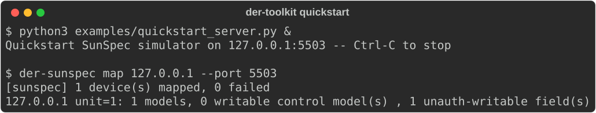
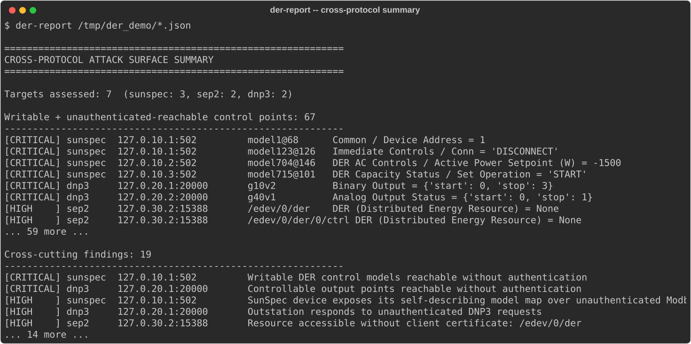

# DER Toolkit

[](https://github.com/Fortiphyd/der-toolkit/actions/workflows/ci.yml)


Attack-surface mapping and protocol fuzzing for distributed energy resource (DER)
protocols — **DNP3**, **SunSpec Modbus**, and **IEEE 2030.5** — with an **MCP
server** that lets an AI assistant drive the tools and reason over the results.

Built as part of a DOE-funded research effort to help asset owners answer a
concrete question: *which device commands and registers are reachable by an
unauthenticated attacker on my network?*

> ⚠️ **These are offensive tools.** Mapping is read-only; fuzzing can hang or
> crash live grid equipment. Only use them against devices you own or are
> explicitly authorized to assess. See [SECURITY.md](SECURITY.md).

## Layout

```
der_common/   shared AttackSurface schema + safety/scope gate + run storage
der_sep2/     IEEE 2030.5: discover / tls / map / fuzz   (most mature)
der_dnp3/     DNP3: scan / map / fuzz (boofuzz)
der_sunspec/  SunSpec Modbus: self-describing model map + device/client fuzzers
der_mcp/      MCP server exposing all of the above
examples/     sample outputs + a quickstart device simulator script
demo/         a simulated 7-device DER cluster spanning all three protocols
```

Every mapper/fuzzer normalizes to one `AttackSurface` model
(`der_common/schema.py`) so results are comparable across protocols — the point
the toolkit is built to demonstrate.

## Install

```bash
pip install -e ".[all]"      # everything, or pick groups:
pip install -e ".[sunspec]"  # just the SunSpec mapper
pip install -e ".[mcp]"      # + the MCP server
```

## Quickstart

See it work end to end against a real (simulated) device — no hardware, no
vendor docs, no target of your own required.

```bash
# 1. Install der-toolkit
pip install -e ".[sunspec]"

# 2. Start a tiny SunSpec/Modbus device simulator on 127.0.0.1:5503
#    (pure Python, built on the pymodbus dependency you just installed --
#    no separate simulator tool or compiled binary needed)
python3 examples/quickstart_server.py

# 3. In another terminal, map its attack surface
der-sunspec map 127.0.0.1 --port 5503
```



That one unauth-writable field is real: the device's Modbus `DA` (Device
Address) register accepts unauthenticated writes, flagged `critical` in the
full JSON output (`der-sunspec map ... --output result.json`). Compare against
[examples/sunspec_attack_surface.sample.json](examples/sunspec_attack_surface.sample.json)
for the complete shape.

## Other CLIs

```bash
der-sep2    map <host> --client-cert c.crt --client-key c.key
der-dnp3    map <host> --port 20000
```

## Cross-protocol summary

Every `map --output result.json` command saves the same `{"attack_surfaces":
[...]}` shape regardless of protocol. `der-report` merges any mix of them into
one severity-ranked view — the writable, unauthenticated-reachable points
across your whole DER deployment, not three separate JSON files you have to
cross-reference by hand:

```bash
der-report dnp3_result.json sunspec_result.json sep2_result.json
```



That's real output (trimmed for length) from the demo cluster below — 7
targets, 67 writable/unauthenticated-reachable points, 19 cross-cutting
findings. Full, untrimmed version:
[examples/demo_cluster_report.sample.txt](examples/demo_cluster_report.sample.txt)
([structured JSON](examples/demo_cluster_report.sample.json)).

## Demo: a simulated DER cluster

[`demo/`](demo/README.md) stands up seven simulated devices at once —
three SunSpec inverters with deliberately different control surfaces, two
DNP3 outstations (binary vs. analog actuation), and two SEP2 servers
(hardened vs. vulnerable) — for a full-pipeline run against something that
looks like a real small DER deployment, not just a single isolated target:

```bash
demo/sep2_server/setup.sh      # one-time: generate the SEP2 test PKI
python3 demo/run_cluster.py    # starts all seven devices
```

## MCP server

`der-mcp` speaks MCP over stdio; point Claude Desktop / Claude Code at it. Tools:
`list_capabilities`, `discover_targets`, `map_attack_surface` (read-only),
`start_fuzz` / `get_job` / `get_findings` (async, gated behind explicit consent).

This repo ships a project-scoped `.mcp.json` that registers `der-mcp` (after
`pip install -e ".[mcp]"`). Claude Code will prompt you to approve it the first
time you open this directory — that one-time prompt is Claude Code's own trust
gate for repo-committed MCP servers, not something this project can or should
skip. To register it manually instead: `claude mcp add --scope project der-mcp
-- der-mcp`.

## Status

All three protocol packages and the MCP server are working end-to-end, including
live validation against a real reference implementation for each protocol: a real
DNP3 outstation, a real SunSpec device simulator, and a real IEEE 2030.5 test
server. Known gaps: no testing yet against physical vendor hardware, and 9 of
the newer 700-series SunSpec DER control models (the ones with a runtime-sized
curve table) still fall back to a coarse, model-level control point rather
than field-level decode — see `der_sunspec/smdx/NOTICE.md`.
